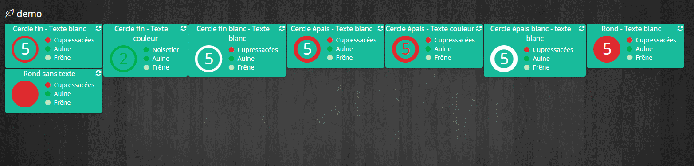

Description 
===

Plugin permettant de récupérer les pollens actifs dans une region de france métropolitaine donnée.
Ces informations sont rafraichies tous les jours.

Le plugin récupère les informations via le site de la RNSA
[ici](http://www.pollens.fr/docs/vigilance.html)

Configuration
=============

> Il suffit de créer un équipement et de sélectionner votre région à l'intérieur de celui-ci

> Il est possible de selectionner uniquement certains pollens. Pour cela, il suffit de rendre invisible les commandes des pollens non-désirés

Le widget
=========

> Plusieurs visualisation sont possibles:

